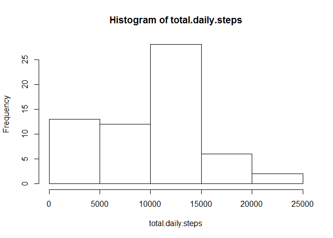
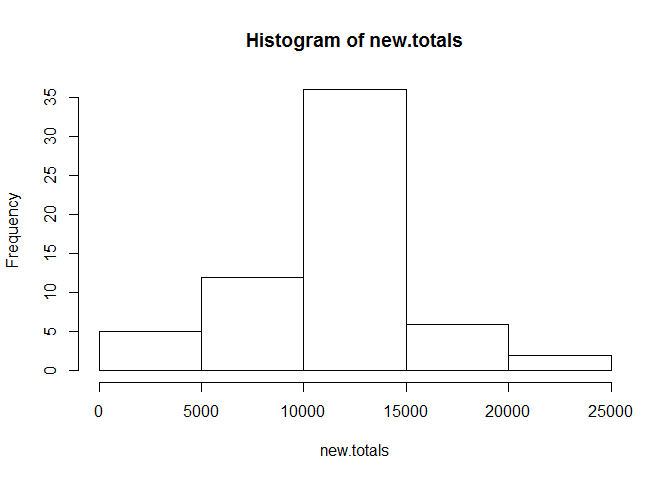
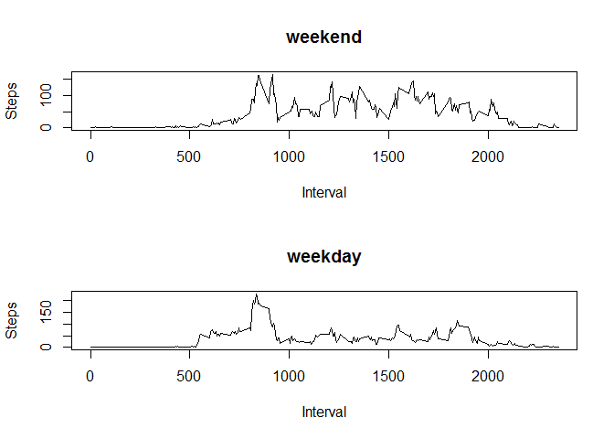

# Reproducible Research: Peer Assessment 1


## Loading and preprocessing the data

The data is stored in activity.zip. First, we unzip the archive and read in
the CSV.


```r
unzip("activity.zip")
activity.data <- read.csv("activity.csv")
str(activity.data)
```

```
## 'data.frame':	17568 obs. of  3 variables:
##  $ steps   : int  NA NA NA NA NA NA NA NA NA NA ...
##  $ date    : Factor w/ 61 levels "2012-10-01","2012-10-02",..: 1 1 1 1 1 1 1 1 1 1 ...
##  $ interval: int  0 5 10 15 20 25 30 35 40 45 ...
```
We see that the data is in long form. For our analysis, it makes more sense to
have the code in wide form, with each observation being one day and each
variable being a five-minute interval. This is easily achieved using tidyr.


```r
library(tidyr)
tidy.data <- spread(activity.data, interval, steps)
dim(tidy.data)
```

```
## [1]  61 289
```
A row for each day, and a column for the date and each interval.

## What is mean total number of steps taken per day?

To calculate total number of steps each day, we simply need to sum the
numeric columns (i.e. 2 through 289) across each observation.


```r
total.daily.steps <- rowSums(tidy.data[2:289], na.rm = TRUE)
hist(total.daily.steps)
```

<!-- -->

```r
mean(total.daily.steps)
```

```
## [1] 9354.23
```

```r
median(total.daily.steps)
```

```
## [1] 10395
```

## What is the average daily activity pattern?

Our "average day" is determined by looking at the average number of steps taken
in a given five-minute interval.


```r
avg.steps <- colMeans(tidy.data[2:289], na.rm = TRUE)
plot(names(avg.steps), avg.steps, type = "l",
     xlab = "Interval", ylab = "Steps")
```

<!-- -->

Which interval has the highest number of steps, on average?


```r
names(which(avg.steps == max(avg.steps)))
```

```
## [1] "835"
```

## Imputing missing values

In our tidy data, an observation (day) is either missing or not; calculating
the number of missing cases is therefore straightforward.


```r
sum(!complete.cases(tidy.data))
```

```
## [1] 8
```

To impute the missing data, let us leverage our earlier calculation of the
"average day." For each missing row, we will fill in the averages.


```r
missing.cases <- which(!complete.cases(tidy.data))
completed.data <- tidy.data
completed.data[missing.cases, 2:289] <- rep(avg.steps,
                                            each = length(missing.cases))
```

Let us compare the "completed" data to our original data.


```r
new.totals <- rowSums(completed.data[2:289])
hist(new.totals)
```

<!-- -->

```r
mean(new.totals)
```

```
## [1] 10766.19
```

```r
median(new.totals)
```

```
## [1] 10766.19
```

The mean and median have both increased, and the values now seem to approximate
a normal distribution --- the mean and median are even equal!

## Are there differences in activity patterns between weekdays and weekends?

To create the factor which labels each day "weekday" or "weekend," we will
have to create a vector which determines what constitutes a weekday.


```r
weekday <- c("Monday", "Tuesday", "Wednesday", "Thursday", "Friday")
```

Then we will coerce the dates in the date column to Date objects, and use the
**weekdays** function to determine the day of the week corresponding to each
observation. The factor variable is constructed by comparing the result to
our *weekday* vector.


```r
day.of.week <- weekdays(as.Date(completed.data$date, format = "%Y-%m-%d"))
completed.data$day.type <- factor((day.of.week %in% weekday),
                                  levels = c(FALSE, TRUE),
                                  labels = c("weekend", "weekday"))
```

Now we can split the data into weekdays and weekends, and plot the averages.


```r
par(mfcol = c(2, 1))
by.day.type <- split(completed.data, completed.data$day.type)
for (i in 1:2) {
  type <- names(by.day.type[i])
  dats <- by.day.type[[i]]
  avgs <- colMeans(dats[2:289])
  plot(names(dats[2:289]), avgs,
       xlab = "Interval",
       ylab = "Steps",
       main = type,
       type = "l")
}
```

<!-- -->

Indeed, there are differences: activity starts later on weekends, ends later,
and overall activity is higher.
